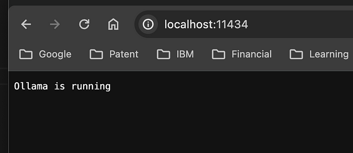

## Ollama - Build a ChatBot with Langchain, Ollama & Deploy on Docker

This guide will walk you through the process of building a chatbot using Langchain and Ollama, and deploying it on Docker.

## Quickstart

1. Clone the repository to your local machine.

2. Create a Virtual Environment:

```
python3 -m venv ./ollama-langchain-venv
source ./ollama-langchain-venv/bin/activate
```
   
3. Install the requirements: 

```
pip install -r requirements.txt
```

4. Install the Docker:

```
docker run -d -v ollama:/root/.ollama -p 11434:11434 --name ollama ollama/ollama
```

5. Install <a href="https://ollama.ai">Ollama</a> and pull LLM model specified in config.yml

6. Run the LLama2 model using Ollama

```
ollama pull llama2
ollama run llama2
```

7. Interact with the container using ```docker exec``` :

```
docker exec -it ollama ollama run phi
```

8. Build the docker image

```
docker build . -t viprasingh/ollama-langchain:0.1
```

9. Check if the Docker image is built, using:

```
docker images
```

10. Bring up the applications by running:

```
docker-compose up
```

11. We should be able to see the containers running by executing:

```
docker-compose ps
```
We should be able to check, if ollama is running by calling http://localhost:11434, as shown in the screenshot below.



12. We can download the required model by logging into the docker container using the ```docker exec``` command as shown:

```
docker exec -it ollama-langchain-ollama-container-1 ollama run phi
```

